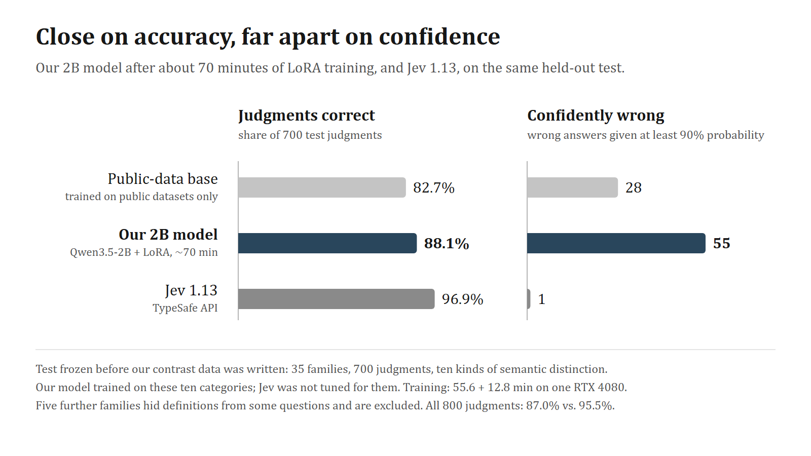

# Building a Jev-like judge on one GPU

Jev, TypeSafe's decision model, reads a record once and answers typed questions about it with probability distributions. A Noul question returns the probability that a yes/no proposition holds, a Choice question returns a distribution over named options, and a Score question returns a distribution over ordered rubric levels. Jev never generates text.

This repository documents our attempt to build a comparable judge from an open 2B model on one desktop GPU. It collects the recipe, the frozen test and saved predictions, every training run with its compute, the experiments that did not work, and what the work taught us about using Jev alongside LLM judges. It is a research snapshot taken on 23 September 2026, while one experiment was still running.

This is independent work. It does not describe how Jev is built or trained; TypeSafe has not published those details, and nothing here is endorsed by TypeSafe.

## Headline result

On a frozen, independently written test, our selected checkpoint answers 617 of 700 judgments correctly (88.1%). Jev 1.13.0 answers 678 (96.9%). The checkpoint is Qwen3.5-2B with rank-8 LoRA adapters and two small readout heads, trained for about 68 minutes on one RTX 4080: 55.6 minutes on public research datasets, then 12.8 minutes on contrastive examples written in natural language.

The accuracy gap is 8.8 points. The confidence gap is far larger: our model gives 55 wrong answers with at least 90% probability, and Jev gives one.

| System | All 800 judgments | Wrong at ≥ 0.90 | 35 untouched families (700) | Wrong at ≥ 0.90 |
|---|---:|---:|---:|---:|
| Public-data base (v0.2) | 650 (81.2%) | 31 | 579 (82.7%) | 28 |
| Templated language, 1,000 updates | 675 (84.4%) | 79 | 601 (85.9%) | 69 |
| Natural language, 1,000 updates | 682 (85.2%) | 69 | 609 (87.0%) | 59 |
| **Natural language, update 500 (selected on validation)** | **696 (87.0%)** | **65** | **617 (88.1%)** | **55** |
| Jev 1.13.0 | 764 (95.5%) | 2 | 678 (96.9%) | 1 |

What the test is and is not:

- It has 160 requests and 800 judgments in 40 families across ten semantic categories: claim vs. completion, permission vs. execution, unknown vs. failure, entity binding, action binding, temporal scope, reversal and current state, negation and quantifiers, attribution and endorsement, and ordered rubrics. Each family has four variants of a record and five questions spanning Noul, Choice and Score.
- It was authored independently and frozen before any training language was generated. Our training data covers the same ten categories with different families; Jev was not tuned for them. The comparison therefore favors our model.
- After checkpoint selection, an audit found five families in which some questions depended on definitions that appeared only in sibling questions. Each question is scored with the shared state and its own text, so those definitions were invisible. The right-hand columns exclude the five families. Copying the definitions into the shared state, as a post-hoc sensitivity check, gives 87.1% for our model and 97.1% for Jev.
- On the untouched families, mean negative log-likelihood is 0.545 for our model and 0.094 for Jev; the Brier score is 0.203 and 0.042.
- It is small (four families per category), synthetic and model-written, and our model has one training seed. It measures specific semantic distinctions, not general judgment ability.

Recompute the table from the saved predictions with `python evaluation/paired-language-v1/score_predictions.py`. Details: [full report](research-log/reports/paired-language-v1/RESULTS.md), [original frozen scores](research-log/reports/paired-language-v1/ORIGINAL_RESULTS.md), [notes on Jev's errors](research-log/reports/paired-language-v1/jev-error-notes.md), [the test and its predictions](evaluation/paired-language-v1/README.md).

## What we learned

1. **Never generate.** Scoring the permitted answers from a shared context was 3.4–3.7× faster than generating the same JSON on our labeled tests, up to 8.5× on 28-field schemas, and schema-valid by construction. Untrained, it was fragile: switching answer codes from letters to digits dropped accuracy from 78.8% to 48.1%. [Recipe](docs/recipe.md)
2. **Public data teaches the interface; contrastive families teach the distinctions.** One pass over 20,000 public-dataset examples raised held-out accuracy from 65.5% to 87.3%, but the model still treated an assistant's claim that a job was done as confirmation that it was done. Minimal-pair families, generated fact-first and written by GPT-5.6 Terra and Sol, fixed much of that. [Contrast data](docs/recipe.md#6-contrastive-data)
3. **Most of what we tried next did not close the gap.** Eight times more synthetic families left accuracy flat while log loss doubled. Cross-entropy plus Brier, teacher distributions from Qwen3.5-4B or Jev, and larger readout heads did not beat a calibrated baseline. Broader rubrics and natural language helped modestly. [What we tried](docs/what-we-tried.md)
4. **Calibration fixes confidence, not decisions.** Temperature scaling cut log loss from 1.55 to 0.51 without changing a single answer.
5. **The distinctions are reachable with deliberation.** The original Qwen3.5-2B answered all 15 of the questions whose reasoning finished within 4,096 thinking tokens; direct scoring got 9 of those and our trained judge 13. Half the questions never finished. Moving that reasoning into a single pass is the open problem. [Jev and LLMs](docs/jev-vs-llms.md)
6. **Jev and LLM judges fail differently.** In a 45-case formal-verification audit, Jev was right on 36 in 1.1 seconds at about $0.0006 per case, never accepted a flawed semantics, and rejected half of the faithful ones. LLM judges were right on 43–45 but took 25–70 seconds. [Jev and LLMs](docs/jev-vs-llms.md)
7. **Write questions for a literal reader.** Question IDs and sibling questions never reach the model; Score levels are judged one at a time; counting is unreliable. Combine several narrow questions with a rule fitted to your own labels. [Using Jev](docs/using-jev.md)

## Documents

| Page | Contents |
|---|---|
| [docs/recipe.md](docs/recipe.md) | How to build a Jev-like judge: interface, model, losses, data, inference and evaluation |
| [docs/what-we-tried.md](docs/what-we-tried.md) | Every study in order, with its question, result and lesson |
| [docs/jev-vs-llms.md](docs/jev-vs-llms.md) | Where Jev was strong and weak in our tests, the formal-verification audit, and deliberation vs. a single pass |
| [docs/using-jev.md](docs/using-jev.md) | Question design, decision rules and workflows for developers using Jev |
| [docs/references.md](docs/references.md) | The parallel-decoding demo, papers and eight community reproductions we drew on |
| [research-log/](research-log/README.md) | Original reports and design notes, in the order the work happened |
| [results/](results/) | Training-run ledger, Jev comparisons and the thread figures |

## Compute and cost

- **Hardware.** One RTX 4080 (16 GB) in a shared desktop. All our training and local inference ran on it.
- **Training.** Twenty training arms used about 18.5 GPU-hours of training time; a 21st was running when this snapshot was taken. The largest study, contrast-data scaling, used 5.96 hours before we paused it. See [results/training-runs.csv](results/training-runs.csv).
- **Latency.** Our judge answers a five-question request in about 0.18 s on the 4080 with a deterministic cache layout (0.17 s with the faster, layout-sensitive cache). Jev answered in about 0.35 s per request, network included.
- **Jev.** Listed at $0.042 per million input tokens. All our paid comparison calls together cost well under a dollar at that price.
- **Language generation.** GPT-5.6 Terra and Sol, run as agents; token costs were not recorded.

## Repository map

| Path | What it holds |
|---|---|
| `src/openjev/` | Scorer, judgment model, training losses, data preparation, consistent cached inference, CLI |
| `experiments/` | Runners for every study, as run |
| `tests/` | The original test suite |
| `data/` | Small frozen datasets: the untrained diagnostic and holdouts, the upstream demo examples, the semantic-contrast diagnostic and the paired-language test |
| `evaluation/paired-language-v1/` | Saved predictions for the headline comparison, the contract audit and a scoring script |
| `research-log/` | Reports and design notes copied from the research archive |
| `results/` | CSV tables and the figures used in the announcement thread |

## Running the code

The code is published as it was run, pinned to Python 3.12, PyTorch 2.11 (CUDA 12.8), Transformers 5.17 and the packages in `requirements.lock` and `requirements-training.txt`.

- The untrained shared-context scorer is self-contained. Install the package and run `openjev --suite diagnostic --repeats 3 --output reports/my-diagnostic.json`; the Qwen3.5-2B weights download on first use.
- The trained-judgment workflow and its commands are described in [research-log/design/judgment-workflow.md](research-log/design/judgment-workflow.md).
- The study runners read artifacts from our full research archive: checkpoints, generated corpora, raw Jev responses and the pinned source lock for the public datasets, about 6 GB in all. They are not included here, so most runners and some tests will not run from this repository alone.

## Limitations

- One training seed per arm; small, synthetic, model-written evaluation sets; repeated inspection of development data.
- Jev results are single samples from `jev-1.13.0` at the time of each run. Jev is an external reference in these experiments, not ground truth; its own errors are documented.
- The formal-verification audit is a separate 45-case experiment summarized here from its results table.
- Nothing here identifies Jev's architecture, size or training method.

## Acknowledgements and third-party material

- Harsha Gundala's parallel constrained decoding demo was the starting point for the inference path. Its four example schemas are in `data/upstream/` under their Apache-2.0 license.
- Qwen3.5-2B is released by the Qwen team under Apache-2.0; no model weights are included here.
- The base training data comes from BoolQ, PAWS, CLINC150, BANKING77 and UCI Wine Quality; see [THIRD_PARTY.md](THIRD_PARTY.md). Those datasets are not redistributed here.
- The community reproductions we reviewed are credited in [docs/references.md](docs/references.md).
