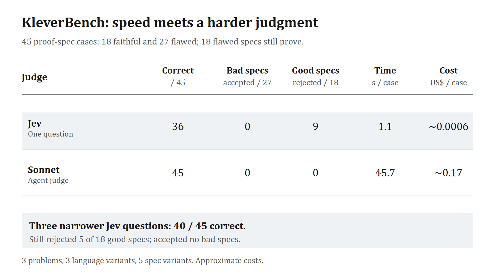
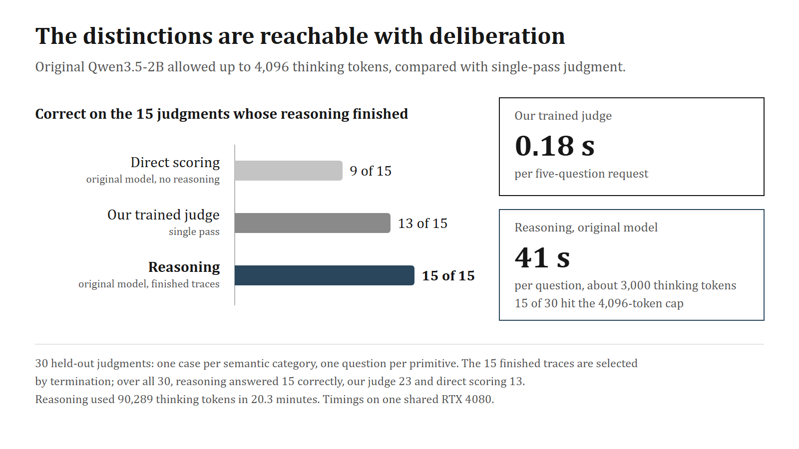

# Jev, our judge and LLM judges

This page collects what we observed about Jev while trying to reproduce it, how it compared with LLM judges in a separate audit, and what a small model can do when it is allowed to reason.

## What is public about Jev

Jev is TypeSafe's "System One" decision model. It reads a state once and answers typed questions in parallel: Noul, Choice and Score, each with a probability distribution. It does not generate text. All our comparisons used `jev-1.13.0`, published at $0.042 per million input tokens. In our calls, a request with several questions took about 0.35 seconds including the network.

TypeSafe describes a new architecture, a parallel sampler and a training method it calls RLCD, aimed at calibrated decisions. The architecture, parameter count, tokenizer and training recipe are not public, and our experiments do not reveal them ([source review](../research-log/reports/JEV_API_MODEL_BOUNDARY.md)).

## Jev on our tests

Jev was an external reference in every comparison: it never saw our training data, and our labels, not Jev's answers, defined correctness.

| Test | Judgments | Our best model | Jev 1.13 |
|---|---:|---:|---:|
| Paired-language test, 35 untouched families | 700 | 88.1% | 96.9% |
| Paired-language test, all 40 families | 800 | 87.0% | 95.5% |
| Contrast pilot, fresh domains and layout | 700 | 95.3% | 99.4% |
| Revised contrast test (from our generator) | 1,185 | 98.7% | 95.2% |
| Original semantic-contrast suite | 764 | 83.5% | 99.5% |
| Live check, eight selected requests | 51 | 30 (base model) | 51 |
| Teacher audit, 80 development cases | 400 | 58.0% (base model) | 96.5% |
| TypeSafe's published example workflows, reference agreement | 336 | 81.0% (base model) | 91.1% (stored answers) |

The same rows, with sources, are in [results/jev-comparisons.csv](../results/jev-comparisons.csv). The revised test is the one place our model led: its families came from the same generator as our training data, and most of Jev's misses there followed a "latest snapshot still holds" reading that the test's contract ruled out.

### Where Jev was strong

- **Claims versus evidence.** For an assistant's unsupported claim that a job was done, Jev put 6% on confirmation; our base model put 96.5%. For a timed-out call, Jev put 5% on completion; our base model put 95.3% ([live check](../research-log/reports/JEV_LIVE_SMOKE.md)).
- **Unknown, when offered.** For an unverified record and for two equally authoritative records that conflict, Jev put 100% on Unknown. Our base model put 27.5% and 22.2%.
- **Probability quality.** On the paired-language test, Jev gave one or two wrong answers with at least 90% probability out of 700–800, against 55–65 for our model. Its mean negative log-likelihood was 0.09–0.12, against 0.55–0.57.

### Where Jev erred

From our error analyses ([paired language](../research-log/reports/paired-language-v1/jev-error-notes.md), [revised test](../research-log/reports/REVISED_INITIALIZATION.md), [contrast pilot](../research-log/reports/CONTRAST_PILOT.md)):

- **Absent evidence read as failure.** Where no attempt was made or no record existed, Jev sometimes chose a definite failure over Unknown (0.56–0.73).
- **Stale snapshots read as current.** It failed 32 of 36 temporal-scope judgments whose contract required evidence from the requested time window.
- **Approvals missed in some layouts.** It missed 18 of 84 recorded policy approvals, 17 of them in two of the three layouts.
- **Definitions in sibling questions.** Where a threshold was defined only in another question, Jev scored 86 of 100 judgments in the affected families; with the definitions copied into the shared state, 99. The questions really are independent.
- **Drift under rewording.** In one test, 9 of 76 meaning-preserving pairs moved by more than 0.05 in probability, although every answer stayed correct.

None of this contradicts TypeSafe's own list of known weaknesses, which includes incorrect decisions and no guaranteed consistency between related questions.

## Jev and LLM judges on KleverBench

We built [45 proof-spec cases](../data/kleverbench-judge-v1/README.md) from three KleverBench problems, five spec variants and three language variants. Eighteen candidate specifications faithfully state the task, and 27 do not. Eighteen of the flawed specs still prove; a prover therefore cannot catch their mismatch with the task. Every judge saw the task, program, language semantics and candidate spec, but not the label or reference spec.

| Judge and setup | Correct | Flawed accepted / 27 | Faithful rejected / 18 | Seconds / case | Approx. USD / case |
|---|---:|---:|---:|---:|---:|
| Jev, one overall question | 36 / 45 | 0 | 9 | 1.1 | 0.0006 |
| Jev, three narrower questions | 40 / 45 | 0 | 5 | Not measured separately | Not measured separately |
| Sonnet agent, tools available | 45 / 45 | 0 | 0 | 45.7 | 0.17 |
| Luna agent, tools available | 43 / 45 | 2 | 0 | 69.6 | 0.0018 |
| Sonnet, one turn without tools | 45 / 45 | 0 | 0 | 42.6 | 0.12 |
| Luna, one turn without tools | 44 / 45 | 1 | 0 | 24.6 | 0.0016 |

The one-question Jev result is about 40 times faster and about 280 times cheaper per case than the Sonnet agent run at the estimated list prices. The agent costs are rough because their full token breakdown was recoverable for only a subset of runs. The agent rows use the first of three runs. The three narrower Jev questions were sent together; their latency and cost were not reported separately.

The five remaining Jev errors in the narrower setup are all faithful specifications in the variant whose operators have swapped meanings. Trimming the language semantics from 26 KB to about 5 KB of rules, and then to relevant rules only, did not improve Jev's accuracy. The LLM judges remained at or near the ceiling even with tools removed and the same inlined files Jev received. This is evidence that working through the language rules is the hard part for Jev here; it does not establish Jev's architecture or a general reasoning limit.

Jev's zero flawed acceptances are encouraging, but 27 negative examples cannot establish a safe automatic acceptance policy. With the one-question setup it accepted only nine faithful specs and would send 36 of 45 cases to a slower judge if all other verdicts were escalated. The suite is also small and built from systematic mutants, not real agent mistakes. We need a larger, more realistic labeled set and a measured routing rule before using Jev to skip review. The [case files, saved responses, report and code](../data/kleverbench-judge-v1/README.md) are in this repository.
## Deliberation and a single pass

Can a 2B model make these distinctions at all? We let the original Qwen3.5-2B reason before answering 30 held-out judgments, one case per semantic category and one question per primitive ([results](../research-log/reports/consistency-native-v1/RESULTS.md)).

- Fifteen answers finished within 4,096 thinking tokens, and all 15 were right.
- On those 15, the same model scoring directly without reasoning was right on 9, and our trained judge on 13.
- The other 15 hit the cap, often repeating themselves. Over all 30, reasoning answered 15 correctly, our judge 23 and direct scoring 13.
- Reasoning used 90,289 thinking tokens and 20 minutes for the 30 questions. Our judge answers a five-question request in about 0.18 seconds.

The finished traces are selected by termination, so 15 of 15 is conditional. Still, the capability is present in the weights. In a six-case follow-up, the sampling settings recommended on the model card let four of six previously capped traces finish. The open problem is to make these distinctions without chain of thought, at single-pass cost.

## What we take from this

- **Different tools for different judgments.** A fast judge handles what the evidence shows directly; a deliberate model is still needed for what has to be worked out. The formal-verification audit and the reasoning probe point the same way.
- **Error direction matters as much as accuracy.** Decide which error is expensive in your application and place thresholds, or a cascade, accordingly.
- **Accuracy is the easier target to match.** Our 2B model came within 9 points of Jev's accuracy in about 70 minutes of training. Matching its probability quality, particularly the rarity of confident mistakes, is what we have not achieved.
