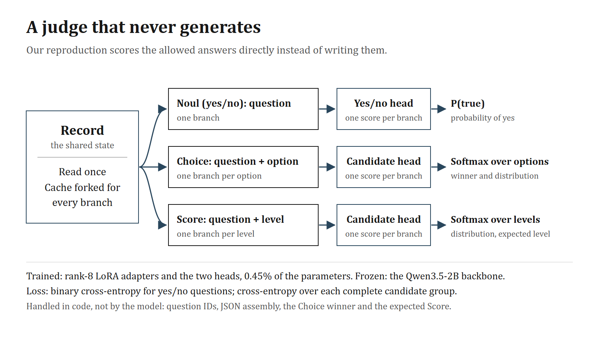
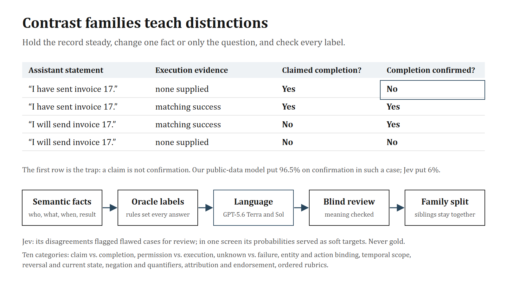

# Recipe: a Jev-like judge from an open model

This page describes how our judge works and how it was trained. It is a reproduction of Jev's public *interface*, built on Qwen3.5-2B. TypeSafe has not published Jev's architecture, size or training method, and nothing here should be read as a description of them.

## 1. The interface

A request carries a `state` (text or JSON) and a map of questions. Each question has a type, instructions and criteria:

| Type | Criteria | Answer |
|---|---|---|
| Noul | optional descriptions of true and false | probability that the proposition is true |
| Choice | up to 255 named options with descriptions | distribution over options and the winner |
| Score | 2–10 ordered levels with descriptions | distribution over levels and the expected level |

TypeSafe's documentation states what reaches Jev's model: question IDs do not; Choice option names and descriptions do; each Score level is evaluated separately, without its index or its neighbors; and questions sharing a state are independent. We adopted the same boundary ([source review](../research-log/reports/JEV_API_MODEL_BOUNDARY.md)).

The learned part of our system maps *(state, question, one criterion)* to one scalar. Everything else is software: normalizing scores into distributions, picking a Choice winner, computing a Score expectation, reattaching IDs and assembling JSON.

One consequence is worth knowing. With isolated candidate scoring and a softmax, the ratio between two options cannot change when a third option is added, because neither branch sees it. A rule such as "pick the second-largest value" is therefore not representable unless the full candidate set is written into the state ([analysis](../research-log/design/architecture-options-v1.md)).

## 2. Inference without generation

We started from Harsha Gundala's parallel constrained decoding demo: prefill the shared context once, fork the cache for each question, and read the logits of the permitted answer tokens only. On Qwen3.5-2B this requires copying both attention caches and the recurrent state of its linear-attention layers.

Untrained, with single-letter answer codes ([first results](../research-log/reports/RESULTS.md), [follow-up](../research-log/reports/INVESTIGATION.md)):

- **Speed.** 206 ms against 759 ms for ordinary JSON generation on 32 labeled cases (3.67×), 3.42× on a fresh holdout, 8.1–8.5× on three 28-field schemas, and 1.65× on a 255-option schema.
- **Validity.** Outputs are schema-valid by construction. JSON generation invented an enum value on one upstream schema.
- **Accuracy.** No reliable advantage: 78.8% against 86.2% for JSON on the first set, 82.5% against 81.7% on the fresh holdout.
- **Fragility.** Digit answer codes dropped development accuracy from 78.8% to 48.1%, and reversing the displayed option order changed 30 of 160 decisions. Four worked examples helped JSON generation (79.5% → 88.0%) but hurt the parallel prompt (78.5% → 60.0%) ([few-shot](../research-log/reports/FEWSHOT.md)). Field-aligned examples reached 90.0%, at 729 ms instead of 128 ms ([aligned examples](../research-log/reports/ALIGNED_FEWSHOT.md)).

That fragility is the argument for training the interface rather than prompting it.

**Batching.** Suffixes of unequal length run together after one shared prefill, with right padding and a guard that isolates extreme length outliers ([batching](../research-log/reports/BATCHING.md)).

**Numerical consistency.** In BF16, the composition of a batch changed answers. For one identical input, the yes/no logit was −0.257 when scored alone and +0.391 when scored beside three identical copies, which flips the decision ([root cause](../research-log/reports/consistency-native-v1/ROOT_CAUSE.md)). Our consistent cached mode derives each unit's prefix from its own state and scores suffixes in fixed four-row tiles with per-unit length buckets. Across 43 requests and 408 scoring units it produced zero differences under pooling, reversal, shuffling and removal of other questions, at 177 ms against 167 ms median per five-question request ([results](../research-log/reports/consistency-native-v1/RESULTS.md), [usage](../research-log/design/consistent-inference.md)). If you build a judge that promises order-independent answers, test this explicitly.

**Trained latency** on the 4080, merged adapters, scoring batches of 32: 80 ms for 5 questions over a short state, 143 ms for 10, 601 ms for 50, and 478 ms for 10 questions over a 4,147-token state. Latency grows with question count ([latency](../research-log/reports/JUDGMENT_LATENCY.md)).

## 3. Model and heads

- **Backbone.** Qwen3.5-2B (1.89B parameters), frozen, in BF16.
- **Adapters.** Rank-8, alpha-16 LoRA on attention, DeltaNet and MLP projections: 8,409,600 parameters.
- **Heads.** A binary head with a bias for Noul, and one compatibility head shared by Choice and Score candidates, 4,097 parameters together. Both read the final token's representation and start from the original vocabulary's A-minus-B direction. Heads and losses run in FP32.
- **Trainable total.** 8,413,697 parameters, 0.45% of the model.
- **Optimizer.** AdamW with weight decay 0.01 and gradient clipping at 1. The base run used learning rates of 1e-4 for adapters and 5e-5 for heads; later continuation studies used 5e-5 and 2.5e-5.

Larger heads were not the bottleneck. Refitting the linear head, splitting it by primitive, or adding a 128-unit MLP all fit a 200-judgment training set perfectly and did not improve held-out decisions ([architecture diagnostics](../research-log/reports/architecture-diagnostics-v1/RESULTS.md)).

## 4. Losses

- **Noul.** Binary cross-entropy on the head's logit.
- **Choice and Score.** Softmax cross-entropy over the complete candidate group. Each candidate is its own branch, but the loss couples them.
- **Consistency (base run only).** For verified exact negations, a penalty on (p + p_neg − 1)², plus distance penalties for meaning-preserving views, at weight 0.1 ([training contract](../research-log/design/training-contract-v0.2.md)).
- **Continuation studies.** Six equally weighted means (new and old data × Noul, Choice, Score), with replay of the original tasks to limit forgetting.

We also tested cross-entropy plus full-vector Brier and 50/50 mixtures of hard labels with teacher distributions. Neither beat hard-label cross-entropy followed by temperature scaling ([calibrated screen](../research-log/reports/calibrated-screen-v1/RESULTS.md)). A proper loss trains probabilities in principle; it does not make a finite model calibrated under shift.

## 5. Base data: public research datasets

| Source | Train bundles | Task |
|---|---:|---|
| BoolQ (Clark et al., 2019) | 4,000 | Passage-grounded Noul |
| PAWS-Wiki (Zhang et al., 2019) | 4,000 | Paraphrase-equivalence Noul |
| CLINC150 (Larson et al., 2019) | 6,500 | Intent Choice among 4 or 8 supplied candidates |
| BANKING77 via Tasksource | 1,500 | Intent Choice among 4 declared candidates |
| UCI Wine Quality (Cortez et al., 2009) | 3,000 | Three-band Score from measurements |
| Constructed policy rubrics | 1,000 | Four-level Score with deterministic answers |

Splits group every connected context before augmentation, so related views never cross splits. Exact negations and sentence swaps add supervised views and consistency relations ([data preparation](../research-log/reports/DATA_PREPARATION.md)).

One pass (5,000 updates of four bundles) took 55.6 minutes and 4.1 GiB, and raised accuracy on 1,500 held-out judgments from 65.5% to 87.3% ([training](../research-log/reports/TRAINING_READINESS.md)). On TypeSafe's published example workflows, agreement with the reference labels rose from 71.7% to 81.0%; the stored Jev answers agreed on 91.1% ([published cases](../research-log/reports/PUBLISHED_CASES.md)).

## 6. Contrastive data

The base model learned the interface, not the nuances. Given an assistant's claim that a job was done and no tool result, it recognized the claim (96.7%) and also put 96.5% on the job being confirmed. Jev put 6% on it ([live comparison](../research-log/reports/JEV_LIVE_SMOKE.md), [semantic contrasts](../research-log/reports/SEMANTIC_CONTRASTS.md)).

**Taxonomy.** We catalogued 21 distinctions and the invariances that must survive rewording, from claim vs. confirmation to temporal scope and rubric boundaries ([inventory](../research-log/design/contrast-taxonomy.md)). A family holds a record steady and changes one fact (the label should change), only the question (the answers may differ), or only the wording (the label should not change).

**Factory.** Facts first, language second:

1. A generator samples semantic facts: actor, target, operation, time, source authority, outcome.
2. A deterministic oracle computes every label from those facts and the supplied rules.
3. Writers render the records in natural language. GPT-5.6 Terra did most of the writing and GPT-5.6 Sol wrote the subtlest families. They never see labels.
4. A separate reviewer reads the text without labels and checks that the intended facts survived, with no answer hints and no missing qualifiers.
5. Families are split as units, and the evaluation set is written independently and frozen first.

Specifications for the later corpora are in the design notes ([factorial generator](../research-log/design/contrast-factorial-generator-v1.md), [scaling generator](../research-log/design/contrast-scaling-generator-v1.md)).

**Writers.** On 64 controlled sentence edits, GPT-5.6 Terra at medium effort produced 63 usable edits and Sol at high effort 64. The released Polyjuice and Tailor generators produced 3 and 6 of 32 in our setup ([tool probe](../research-log/reports/TOOL_EFFORT_PROBE.md)). A writer's first pass can also leak answers: one copied all 240 question instructions verbatim and inserted sentences such as "This is an explicit past-completion assertion." A blind reviewer agreed with every label, which is exactly why label agreement alone is not a quality check ([generation pilot](../research-log/reports/GENERATION_PILOT.md)).

**Jev's role.** Its disagreements with our labels pointed to flawed cases, such as ambiguous wording or definitions a question could not see. In one screen, its probability vectors served as soft training targets. It was never used as gold.

**Effects.** Summarized in [what we tried](what-we-tried.md): 300 scenarios lifted a fresh test from 71.4% to 95.3% against a matched control, at a cost of 4.0 points on the broad tasks; natural language beat templates on evidence-contrast pairs by 5.6 points; broader rubrics added 4.6 points of contrast-pair accuracy; eight times more families added nothing.

## 7. Evaluation practice

What we would keep if we started again:

- **Freeze the test before generating training language,** author it independently, and split by family.
- **Score pairs, not only answers.** A contrast counts only when both endpoints are right. Report positive and negative controls: a model that always answers "no" looks good on negatives.
- **Report probability quality with coverage.** Count wrong answers above 0.90 and how many answers are above 0.90; report NLL and Brier; compare against a temperature-calibrated baseline, not the raw one.
- **Gate on retention** of the original tasks, per primitive.
- **Inspect the rendered model inputs.** Our worst evaluation defect was a definition that lived only in a sibling question.
- **Quarantine the final test and the reference model's answers** until checkpoint selection is locked.
