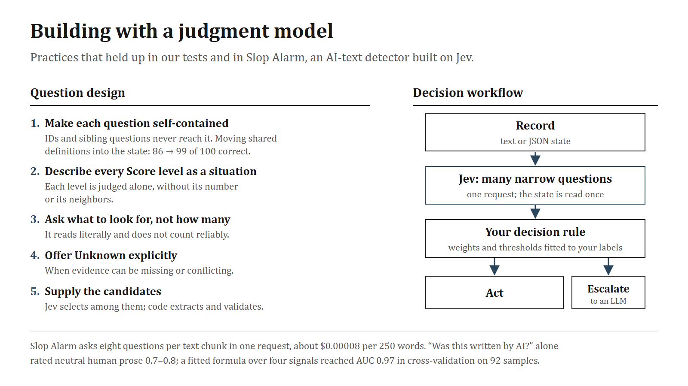

# Building with Jev

Practices that held up in our experiments and in Slop Alarm, a separate project that uses Jev to estimate whether a text was written by AI. They apply to Jev and, with small changes, to any judge that scores typed answers instead of generating text.

## Designing questions

**Make every question self-contained.** Question IDs never reach the model, and questions sharing a state do not see each other. On our paired-language test, some questions relied on a threshold or definition written only in a sibling question. Jev got 86 of 100 judgments in those families right. With the definitions copied into the shared state, it got 99. Put shared definitions and rubrics in the state, and write each question's instructions as if it were the only one.

**Describe every Score level as a concrete situation.** Each level is judged on its own, without its number or its neighbors, so "some", "more" or "level 3" carry no meaning. Write what a record looks like at that level: "One or two isolated instances that a careful human writer might also use on purpose."

**Phrase yes/no questions so that a high value means yes,** and give explicit true and false descriptions.

**Ask what to look for, not how many.** Slop Alarm found that Jev reads questions literally and does not count reliably. Describe the pattern and let a Score level say whether it is absent, occasional or pervasive.

**Offer Unknown explicitly when evidence can be missing or conflicting,** and define it. When it was offered for an unverified record and for conflicting records, Jev put 100% on it. Without such an option, absent evidence can be read as failure.

**Separate predicates that sound alike.** "Did the assistant claim the refund?", "Does a tool result confirm the refund?" and "Was the refund permitted?" are three questions. Asking them separately is what lets a judge tell them apart, and lets you check it.

**Supply the candidates.** Jev selects; it does not produce strings. TypeSafe's extraction cookbooks find candidates with code or an LLM, let Jev choose or verify, and normalize the result in code.

## Turning probabilities into decisions

**Do not rely on one headline question.** In Slop Alarm, "Was this text generated by an AI language model?" on its own rated neutral encyclopedic human prose at 0.7–0.8, enough to flag about a third of human text. Slop Alarm sends it together with seven narrower questions in the same request: stock phrasing, staged emphasis, rule-driven rhythm, inflated significance, decorative formatting, chatbot residue and first-hand specifics. A logistic formula over four of the eight signals, fitted to labeled samples, reached AUC 0.97 in cross-validation that held out each sample with its topic-matched twin. The set was small: 44 human and 48 AI samples, all AI samples from Claude models. No human sample reached the "likely AI" band, which still allows a true false-positive rate of about 7%.

**Fit weights and thresholds to your own labels,** hold out related samples together, and keep human-written calibration text verifiably human.

**Put the cost of each error into the threshold.** In our formal-verification audit, Jev never accepted a flawed semantics but rejected half of the faithful ones, so an acceptance was reliable and a rejection was a reason to look closer ([audit](jev-vs-llms.md#jev-and-llm-judges-in-a-formal-verification-audit)).

**Use the probabilities, not the confidence field.** Jev's `confidence` is a statistic of the distribution's concentration, not the probability that the answer is right.

**Leave margin around thresholds.** Meaning-preserving rewording moved 9 of 76 Jev probabilities by more than 0.05 in one of our tests. Test paraphrases of your own questions before you trust a threshold near the middle.

**Pin the model version and version your scoring.** A formula calibrated on `jev-1.13.0` is calibrated on that version. Slop Alarm pins the model identifier and bumps a scoring version, part of its cache key, whenever questions or weights change.

## Workflow patterns

| Pattern | How it works | Example |
|---|---|---|
| Feature extractor | Many narrow questions in one request feed a fitted rule | Slop Alarm's AI-text estimate |
| First-stage gate | Jev decides the cases its error profile makes safe; the rest go to a deliberate judge | Formal-verification audit |
| Verifier | An LLM extracts; Jev checks each field; a stronger model handles escalations | TypeSafe's structured-extraction cascade cookbook |
| Router | A Choice over routes or queues, with Unknown sent to a person | Support triage |

## Cost and latency

- Jev reads the state once per request, so put every question about a state in one request. Slop Alarm sends eight questions per 250-word chunk: about 1,750 input tokens, or roughly $0.00008 per chunk at $0.042 per million input tokens.
- In our calls a multi-question request took about 0.35 seconds including the network; in the formal-verification audit, 1.1 seconds per case.
- Cache answers by a hash of model version, questions and input. Slop Alarm caches scores only, never the text.
