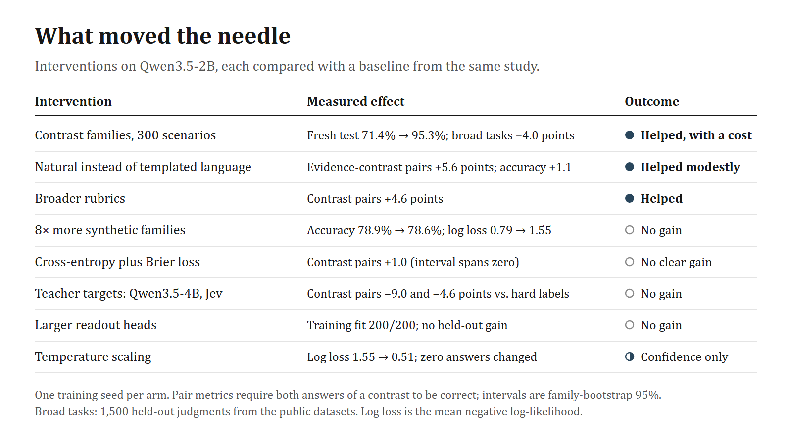

# What we tried

Every study from 19 to 23 September 2026, in order. Each links to its full report in the research log. Training time for every arm is in [results/training-runs.csv](../results/training-runs.csv). All runs used one training seed on one RTX 4080.

## Summary

**Helped:** training the interface on public data; contrastive families; natural rather than templated language; broader rubrics; selecting only the evidence a question needs (as a diagnostic); a deterministic cache layout for consistent answers.

**Did not beat a calibrated baseline:** eight times more synthetic families, cross-entropy plus Brier, teacher distributions from Qwen3.5-4B or from Jev, larger readout heads, few-shot prompting of the untrained scorer.

**Fixed confidence only:** temperature scaling.

**Still open:** making the distinctions without chain of thought. The original model reaches them when it reasons, and our current attempt supervises intermediate facts during training.

## Studies in order

### 1. Untrained shared-context scoring (19 September)

*Can a stock 2B model answer typed questions by scoring permitted answer codes instead of generating JSON?*
It is 3.4–3.7× faster on labeled tests and up to 8.5× on 28-field schemas, and always schema-valid, but no more accurate than JSON generation and very sensitive to presentation: digit codes gave 48.1% against 78.8% for letters; display reversal changed 30 of 160 decisions; few-shot examples hurt (78.5% → 60.0%) unless aligned to each field (90.0%, at 5.7× the latency).
**Lesson:** the mechanism works; the interface has to be trained.
[Results](../research-log/reports/RESULTS.md) · [answer encoding](../research-log/reports/INVESTIGATION.md) · [few-shot](../research-log/reports/FEWSHOT.md) · [aligned examples](../research-log/reports/ALIGNED_FEWSHOT.md) · [shorter examples](../research-log/reports/COMPACT_FEWSHOT.md) · [batching](../research-log/reports/BATCHING.md)

### 2. What Jev's public contract implies (19 September)

*What reaches Jev's model, and what should our model be responsible for?*
Question IDs do not reach the model; Score levels are judged in isolation; Jev returns distributions, not text. Its `confidence` field is a concentration statistic, not the probability of being right.
**Lesson:** keep IDs, JSON and derived fields in software; train only semantic scoring; evaluate calibration separately from accuracy.
[Capabilities](../research-log/reports/JEV_CAPABILITIES.md) · [API/model boundary](../research-log/reports/JEV_API_MODEL_BOUNDARY.md) · [probability design](../research-log/reports/PROBABILITY_DESIGN.md) · [consistency data audit](../research-log/reports/CONSISTENCY_DATA_AUDIT.md)

### 3. Base training on public data, v0.2 (20 September)

*Can LoRA plus numerical heads learn the interface from public datasets?*
One pass over 20,000 bundles from BoolQ, PAWS, CLINC150, BANKING77, wine quality and synthetic rubrics took 55.6 minutes; held-out accuracy rose from 65.5% to 87.3%. On TypeSafe's published example workflows, reference agreement rose from 71.7% to 81.0% (stored Jev answers: 91.1%), but Score agreement did not improve.
**Lesson:** a small model learns the interface quickly; descriptive rubrics need their own data.
[Data](../research-log/reports/DATA_PREPARATION.md) · [training](../research-log/reports/TRAINING_READINESS.md) · [published cases](../research-log/reports/PUBLISHED_CASES.md) · [latency](../research-log/reports/JUDGMENT_LATENCY.md)

### 4. Semantic contrasts and their diagnosis (20 September)

*Does the model separate a claim from its confirmation, permission from execution, and missing evidence from failure?*
No. On 764 frozen judgments it reached 60.6%, got both answers right on 26 of 90 evidence-change pairs, and gave 100 wrong answers with at least 95% probability. Restricting each question to the evidence it needs raised accuracy from 60.1% to 73.2% in a matched diagnostic. Serializing the same state as a JSON string changed 34 decisions. Temperature scaling removed the high-confidence errors without correcting any of them. Jev answered all 51 judgments of an eight-request live check correctly; our model answered 30.
**Lesson:** the base model had learned association, not evidence. Measure both answers of each contrast, and treat confidence and correctness as separate problems.
[Semantic contrasts](../research-log/reports/SEMANTIC_CONTRASTS.md) · [examples](../research-log/reports/semantic-contrasts-v1/examples.md) · [diagnosis](../research-log/reports/CONTRAST_DIAGNOSIS.md) · [calibration probe](../research-log/reports/CONTRAST_CALIBRATION.md) · [live Jev check](../research-log/reports/JEV_LIVE_SMOKE.md)

### 5. Contrast pilot (20 September)

*Do 300 contrastive scenarios teach those distinctions?*
A fresh test with new domains, wording and layout rose from 71.4% (matched control) to 95.3%; Jev scored 99.4%. Broad-task accuracy fell 4.0 points against the control, mostly on Score tasks, which the new data lacked. The model also overcorrected: it confirmed only 12 of 32 genuinely completed actions, down from 32.
**Lesson:** contrast data works fast; balance primitives, keep positive controls, and replay the original tasks.
[Report](../research-log/reports/CONTRAST_PILOT.md)

### 6. Community reproductions (20 September)

*What do SemIf, Simple Jev, Laya, Von, Verdict, Kev, Nimble and OpenJev do, and what should we borrow?*
Mechanisms worth borrowing: Nimble's evidence audits, Kev's compositional rules and conservative learning rates, Simple Jev's distribution targets, Verdict's cross-entropy plus Brier. Cautions: in one repository, 48 of 78 benchmark inputs appear verbatim in its training pools; another records zero accuracy on Khmer text at about 95% mean confidence.
**Lesson:** read the code and the data pipeline, not the headline numbers.
[Review](../research-log/reports/REFERENCE_STRATEGIES.md) · [references](references.md)

### 7. Revised data and fresh vs. continued initialization (20–21 September)

*With Score contrasts, three layouts and balanced primitives, is starting from the original Qwen better than continuing from v0.2?*
Both reached about 98.5% on the revised contrast test. Jev scored 95.2%; most of its misses treated a stale or future snapshot as evidence of the current state, which the test's contract ruled out, and six came from ambiguous wording in our labels. The continued model kept broad accuracy (88.4%); the fresh one did not (83.1%). On the older semantic suite both stayed far below Jev (78.1% and 83.5% against 99.5%).
**Lesson:** high scores on data from the same generator do not transfer; test on independently written families.
[Dataset](../research-log/reports/REVISED_DATASET.md) · [results](../research-log/reports/REVISED_INITIALIZATION.md)

### 8. Generating contrasts (20–21 September)

*Which writer produces precise, varied contrasts: paper tools or instruction models?*
Polyjuice and Tailor produced 3 and 6 usable edits of 32; GPT-5.6 Terra at medium effort 63 of 64 and Sol at high effort 64 of 64. One writer's first pass copied every question verbatim and wrote answers into the records.
**Lesson:** specify meaning before text, review the text blind to labels, and check construction rules separately from label agreement.
[Research](../research-log/reports/CONTRAST_GENERATION_RESEARCH.md) · [generation pilot](../research-log/reports/GENERATION_PILOT.md) · [tool probe](../research-log/reports/TOOL_EFFORT_PROBE.md) · [taxonomy](../research-log/design/contrast-taxonomy.md)

### 9. Paired language: natural vs. templated (21 September)

*With the facts, labels and budget fixed, does natural language beat templates?*
Modestly. At 1,000 updates, natural language added 1.1 points of accuracy (interval spans zero) and 5.6 points on evidence-contrast pairs. The selected natural checkpoint is the headline model: 88.1% on 700 untouched judgments, against Jev's 96.9%. An audit then found five test families whose definitions were visible only to sibling questions.
**Lesson:** language diversity helps a little; rubric diversity matters too, since the model applied a familiar training rubric to a different supplied one.
[Results](../research-log/reports/paired-language-v1/RESULTS.md) · [original scores](../research-log/reports/paired-language-v1/ORIGINAL_RESULTS.md) · [examples](../research-log/reports/paired-language-v1/EXAMPLES.md) · [Jev's errors](../research-log/reports/paired-language-v1/jev-error-notes.md) · [contract](../research-log/design/paired-language-contract-v1.md)

### 10. Scaling contrast data (21 September)

*Does more synthetic data help?*
Accuracy on 800 validation judgments rose from 69.4% to 78.9% in the first 200 families, then stayed flat through 1,692 (78.6%) while log loss doubled (0.79 → 1.55). At the pause, answers given at least 90% probability had a mean stated probability of 99.6% and were right 82.5% of the time. We paused after 5.96 GPU-hours of a planned 5,000 families.
**Lesson:** more of the same generator buys confidence, not accuracy.
[Status](../research-log/reports/contrast-scaling-v1/STATUS.md) · [GPU validation](../research-log/reports/contrast-scaling-v1/mid-gpu-validation/RESULTS.md) · [pause](../research-log/reports/contrast-scaling-v1/PAUSE.md)

### 11. Post-pause audit (21–22 September)

*Was the plateau a bug, overconfidence, or a data gap?*
No pipeline error was found. Per-primitive temperatures cut log loss from 1.55 to 0.51 with no answer changed. A coverage gap appeared: none of the 20,000 new Score questions had four levels, while every validation Score question did.
**Lesson:** separate the probability scale from the decisions; fix coverage before changing the loss.
[Results](../research-log/reports/post-pause-audit-v1/RESULTS.md) · [calibration](../research-log/reports/post-pause-audit-v1/calibration/RESULTS.md) · [methods review](../research-log/reports/post-pause-audit-v1/methods-review.md) · [calibrated-training research](../research-log/reports/CALIBRATED_TRAINING_RESEARCH.md)

### 12. Rubric breadth and language breadth (21–22 September)

*In a 2×2 design, which matters more: broader rubrics or twice the language patterns?*
Broader rubrics added 4.6 points of contrast-pair accuracy at 200 patterns (interval +0.9 to +8.4). Doubling the language patterns showed no clear effect. The best arm answered 1,193 judgments with at least 90% probability and got 202 of them wrong.
**Lesson:** vary the decision rule, not only the wording.
[Results](../research-log/reports/contrast-factorial-v1/RESULTS.md) · [contract](../research-log/design/contrast-factorial-contract-v1.md) · [generator](../research-log/design/contrast-factorial-generator-v1.md)

### 13. Losses and teachers (22 September)

*Do Brier loss or teacher distributions improve on hard-label cross-entropy?*
Not clearly. Brier alone left accuracy unchanged and raw log loss worse. Qwen3.5-4B targets cost 9.0 points of contrast-pair accuracy; Jev targets cost 4.6. Jev targets plus Brier gave the best raw log loss and the most correct answers, but lower pair accuracy. On an 80-case audit, Jev scored 96.5% and Qwen3.5-4B 60.0%.
**Lesson:** compare every probability method against a temperature-calibrated baseline; a strong teacher is not automatically a good target.
[Results](../research-log/reports/calibrated-screen-v1/RESULTS.md) · [roadmap](../research-log/design/calibrated-training-roadmap-v1.md)

### 14. Architecture diagnostics (22 September)

*Is the readout, the adapter or the input the bottleneck?*
Larger heads fit 200 of 200 training judgments without improving held-out decisions. Repeating the full rubric in every unit helped slightly (152 → 155 of 200). A set-dependent rule is unrepresentable with isolated candidates.
**Lesson:** capacity in the head is not the issue; interface and supervision are.
[Results](../research-log/reports/architecture-diagnostics-v1/RESULTS.md) · [options](../research-log/design/architecture-options-v1.md)

### 15. Consistency and native reasoning (22 September)

*Can we make answers independent of batching, and can the original model reach the distinctions by reasoning?*
Yes to both, partly. A deterministic cache layout removed all observed batch effects at 6% latency cost. With up to 4,096 thinking tokens, the original Qwen3.5-2B answered all 15 of its finished questions correctly, where direct scoring got 9 and our judge 13; the other 15 questions hit the cap.
**Lesson:** the capability is in the weights; the open problem is using it without chain of thought.
[Results](../research-log/reports/consistency-native-v1/RESULTS.md) · [root cause](../research-log/reports/consistency-native-v1/ROOT_CAUSE.md)

### 16. Intermediate supervision (23 September, running)

*Does supervising intermediate facts during training (was a claim made, does the target match, is the event inside the window) transfer to new families, with no change at inference?*
Arm A (control) finished 200 updates in 42.4 minutes; arm B was training when this snapshot was taken.
[Proposal](../research-log/design/intermediate-supervision-pilot-proposal.md)
