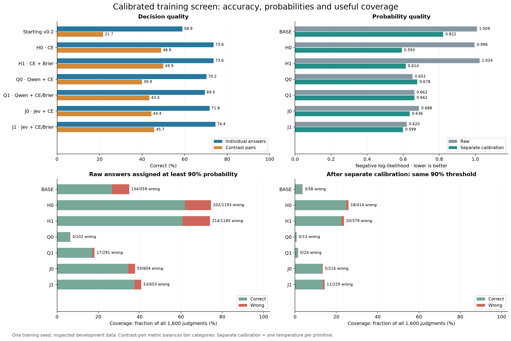
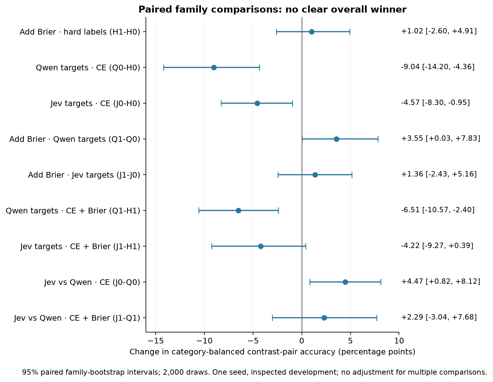
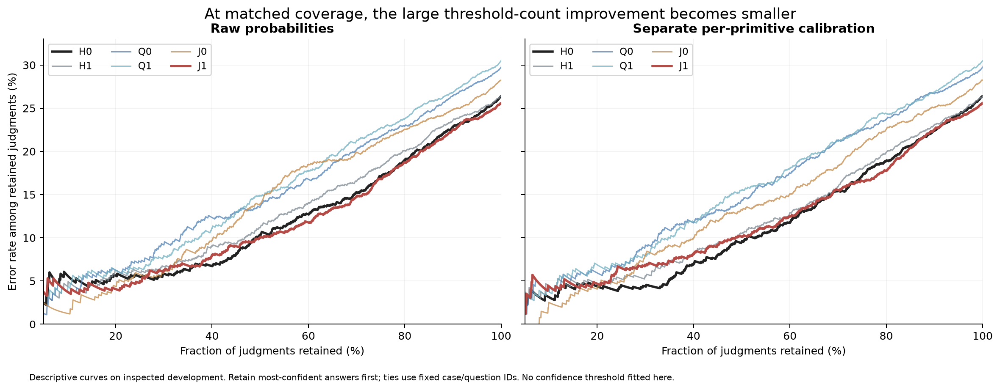
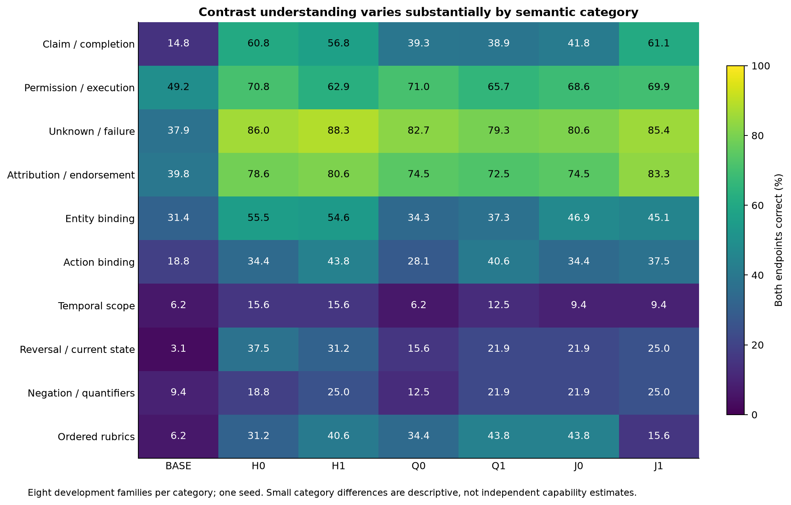

# Calibrated training screen — completed exploratory results

All six arms completed exactly 400 updates. The screen did not establish a clear improvement over temperature-calibrated hard-label CE. Brier alone did not improve probability quality. Jev targets plus Brier achieved the highest individual-answer accuracy and best raw NLL/Brier, but lower category-balanced contrast-pair accuracy; most of the apparent reduction in confident errors came with lower confidence coverage.

These are one-seed results on previously inspected development data. They are useful for choosing the next question, not an independent confirmation of a winner. No checkpoint has been promoted and no follow-on training has been launched.

## What was compared

Every arm started independently from the same original v0.2 checkpoint, with identical fresh Adam/RNG, frozen BF16 body, FP32 adapters/heads, learning rates, update order and replay. Inputs were the same broad-rubric B corpus: 400 families, 1,600 cases, 8,000 new judgments and 1,200 matched old-task replay judgments. This was an objective/teacher comparison, not another data-volume or model-size experiment.

H0/H1 retain hard-label CE. Q/J replace half of the new-data CE with cross-entropy against their cached teacher distributions; the other half remains authored hard-label CE. Suffix 1 adds full-vector Brier against authored labels with weight 1. Old-task replay stays unchanged; six new/old-by-primitive means receive equal weight. Consistency loss is off. The larger teacher is the pinned Qwen3.5-4B release using no-thinking, constrained next-code probabilities averaged over canonical/reversed answer order; this does not test a reasoning teacher or all possible uses of a 4B model.

Assessment contains 80 families, 320 cases and 1,600 judgments. The primary metric requires both endpoints of a meaningful contrast to be correct, averages within each family/category, then weights ten categories equally. It covers 607 contrast relations; 535 invariants are separate. Calibration uses 40 separate families/800 new judgments and 150 separate legacy records; retention uses 300 legacy validation records. All seven model endpoints and all temperature fits were locked before assessment inference.

## Main comparison

| Model | Individual accuracy | Primary pair accuracy | Raw NLL | Per-primitive calibrated NLL | Old-task accuracy |
| --- | ---: | ---: | ---: | ---: | ---: |
| Starting v0.2 | 58.94% | 21.69% | 1.0088 | 0.8218 | 89.67% |
| H0: CE | 73.63% | 48.92% | 0.9960 | 0.5925 | 88.00% |
| H1: CE + Brier | 73.63% | 49.94% | 1.0237 | 0.6141 | 88.00% |
| Q0: Qwen targets + CE | 70.25% | 39.89% | 0.6522 | 0.6781 | 89.33% |
| Q1: Qwen targets + CE/Brier | 69.50% | 43.43% | 0.6617 | 0.6619 | 87.33% |
| J0: Jev targets + CE | 71.75% | 44.36% | 0.6876 | 0.6363 | 88.33% |
| J1: Jev targets + CE/Brier | 74.44% | 45.72% | 0.6196 | 0.5989 | 88.00% |

**Brier alone (H1 versus H0):** individual accuracy is unchanged at 1,178/1,600. Primary paired accuracy rises by 1.02 percentage points, with a 95% paired-family interval of −2.60 to +4.91 points. Raw NLL worsens from 0.9960 to 1.0237 and raw Brier from 0.4234 to 0.4365; per-primitive calibrated NLL is also worse (0.6141 versus 0.5925). This fixed-weight trial does not support Brier as a standalone cure for overconfidence. It does not establish that every Brier weight/objective is ineffective.

**Jev plus Brier (J1):** 1,191/1,600 answers are correct, 13 more than H0 (+0.81 percentage points). Fully correct requests rise only from 126/320 to 128/320. Primary paired accuracy is 45.72%, below H0’s 48.92%; raw NLL improves substantially to 0.6196. After separate calibration, J1’s NLL/Brier are 0.5989/0.3550, close to but slightly worse in point estimate than H0’s 0.5925/0.3523. The raw gain is real, but it does not demonstrate a clear gain over the calibrated baseline.

**Teachers without Brier:** Q0 and J0 reduce raw sharpness but lose primary contrast accuracy versus H0: −9.04 and −4.57 points respectively. Their paired-family intervals exclude zero in this one-seed development comparison. Adding Brier helps the Qwen primary point estimate, but does not restore it to either hard-label baseline.

## Paired family differences

Intervals resample complete families within category, paired across arms (2,000 draws, seed 42). They describe corpus variation, not training-seed variability, and are not adjusted for multiple comparisons.

| Comparison | Primary difference (pp) | 95% family interval (pp) |
| --- | ---: | --- |
| H1-H0 | +1.02 | [-2.60, +4.91] |
| Q0-H0 | -9.04 | [-14.20, -4.36] |
| J0-H0 | -4.57 | [-8.30, -0.95] |
| Q1-Q0 | +3.55 | [+0.03, +7.83] |
| J1-J0 | +1.36 | [-2.43, +5.16] |
| Q1-H1 | -6.51 | [-10.57, -2.40] |
| J1-H1 | -4.22 | [-9.27, +0.39] |
| J0-Q0 | +4.47 | [+0.82, +8.12] |
| J1-Q1 | +2.29 | [-3.04, +7.68] |

## Confidence requires coverage

J1 cuts raw ≥90%-probability errors from H0’s 202 to 53, but coverage falls from 74.56% to 40.81%. Error among that retained group improves from 16.93% to 8.12%. H1, by comparison, makes 214 such errors at 74.06% coverage. The Q0 model makes only three, while covering just 6.38% of judgments. Zero errors on a tiny retained group are not evidence of perfect calibration.

| Model | Raw wrong / ≥90% answers | Raw coverage | Raw error among covered | PT wrong / ≥90% answers | PT coverage | PT error among covered |
| --- | ---: | ---: | ---: | ---: | ---: | ---: |
| BASE | 134/559 | 34.94% | 23.97% | 3/58 | 3.63% | 5.17% |
| H0 | 202/1193 | 74.56% | 16.93% | 18/414 | 25.88% | 4.35% |
| H1 | 214/1185 | 74.06% | 18.06% | 20/379 | 23.69% | 5.28% |
| Q0 | 3/102 | 6.38% | 2.94% | 0/13 | 0.81% | 0.00% |
| Q1 | 17/291 | 18.19% | 5.84% | 0/24 | 1.50% | 0.00% |
| J0 | 53/604 | 37.75% | 8.77% | 5/214 | 13.38% | 2.34% |
| J1 | 53/653 | 40.81% | 8.12% | 11/229 | 14.31% | 4.80% |

A descriptive coverage-matched check makes the improvement more modest. At 50% retained coverage, raw H0 has 10.375% error and raw J1 has 10.000%. After per-primitive calibration, H0 has 9.500% and J1 has 10.125%. At 25% coverage the calibrated rates are 4.5% versus 6.5%; J1 does better at some higher coverages. There is no uniform selective-risk winner. These curves are post-run descriptive analysis; confidence ties use fixed case/question IDs, never correctness.

## Probability quality across every declared calibration variant

GT is one global temperature; PT is one per primitive. Both were fitted on the separate, equally weighted new/legacy macro-primitive calibration objective. All declared variants are reported, rather than choosing one after seeing assessment scores. Positive temperatures preserve winning classes, so accuracy, contrast-pair decisions and Unknown labels are unchanged. Calibration can still move Score means and change cross-question confidence ranking.

| Model | Raw NLL / Brier | GT NLL / Brier | PT NLL / Brier | Raw / PT Score MAE |
| --- | --- | --- | --- | --- |
| BASE | 1.0088 / 0.5744 | 0.8250 / 0.5126 | 0.8218 / 0.5140 | 0.8243 / 0.8597 |
| H0 | 0.9960 / 0.4234 | 0.6093 / 0.3562 | 0.5925 / 0.3523 | 0.4995 / 0.5692 |
| H1 | 1.0237 / 0.4365 | 0.6279 / 0.3678 | 0.6141 / 0.3644 | 0.4986 / 0.5825 |
| Q0 | 0.6522 / 0.3955 | 0.6751 / 0.4093 | 0.6781 / 0.4106 | 0.6616 / 0.7388 |
| Q1 | 0.6617 / 0.4050 | 0.6637 / 0.4035 | 0.6619 / 0.4029 | 0.6050 / 0.6403 |
| J0 | 0.6876 / 0.4026 | 0.6486 / 0.3913 | 0.6363 / 0.3852 | 0.5716 / 0.6535 |
| J1 | 0.6196 / 0.3588 | 0.6010 / 0.3552 | 0.5989 / 0.3550 | 0.5109 / 0.5781 |

Q0’s development NLL worsens after calibration, while its legacy NLL improves. A temperature fitted for the balanced calibration population is not guaranteed to improve every assessment subset. Score mean errors also often worsen when probabilities are softened; probability calibration is not improvement on every output metric.

## Semantic and retention tradeoffs

| Model | Noul accuracy | Choice accuracy | Score accuracy | Entire request correct | Unknown recall / precision |
| --- | ---: | ---: | ---: | --- | --- |
| BASE | 68.13% | 41.56% | 48.75% | 63/320 | 20.24% / 29.31% |
| H0 | 80.10% | 64.06% | 63.75% | 126/320 | 96.43% / 50.94% |
| H1 | 81.04% | 61.25% | 63.75% | 120/320 | 95.24% / 45.71% |
| Q0 | 76.77% | 58.75% | 62.19% | 104/320 | 91.67% / 47.83% |
| Q1 | 75.83% | 57.50% | 62.50% | 99/320 | 95.24% / 43.24% |
| J0 | 80.21% | 56.56% | 61.56% | 102/320 | 96.43% / 42.19% |
| J1 | 80.73% | 62.81% | 67.19% | 128/320 | 95.24% / 52.63% |

J1’s individual gains mainly come from Score and Noul, while Choice falls slightly versus H0. Its primary ordered-rubric category drops from 31.25% to 15.63%, reversal/current state from 37.50% to 25.00%, and temporal scope from 15.63% to 9.38%. These small categories contain eight families each; treat them as diagnostic clues. J1’s overall Score improvement and ordered-rubric contrast decline illustrate why aggregate accuracy is insufficient.

Unknown remains overpredicted: H0 correctly identifies 81/84 gold-Unknown cases but predicts Unknown 159 times; J1 identifies 80/84 and predicts it 152 times. High recall still coexists with only about 51–53% precision. J0 is more extreme at 192 Unknown predictions and 42.19% precision.

Legacy accuracy spans 262–268 correct out of 300, compared with starting v0.2 at 269 and H0 at 264. Q0 retains the most (268), but has weaker new-task decisions. Raw legacy NLL ranges 0.2553–0.2817, versus 0.2567 initially; PT legacy NLL ranges 0.2382–0.2524. There is no large aggregate retention collapse here, but neither complete retention nor statistical equivalence is established.

## Teacher quality on the actual training material

The separate 80-case audit gave Jev 96.5% accuracy and Qwen4B 60.0%, versus the starting student’s 58.0%. Both passed the gate fixed before collection. That audit is not the full 320-case student assessment, so its scores should not be added to the main table as a like-for-like model benchmark.

After student results, a descriptive check of the already saved training targets found lower agreement with authored training labels. No targets were filtered, relabeled or retuned using this analysis.

| Teacher | Training gold agreement | Noul / Choice / Score agreement | Mean gold probability | Mean entropy (nats) |
| --- | ---: | --- | ---: | ---: |
| Jev | 82.86% | 86.83% / 80.00% / 73.81% | 0.7667 | 0.3549 |
| Qwen4B estimator | 57.29% | 64.00% / 52.31% / 42.13% | 0.4629 | 0.8502 |

Qwen’s Noul entropy is 0.6835 nats, close to the uniform binary value 0.6931. Its teacher supervision therefore contains substantial softening as well as imperfect semantic information. Jev also disagrees with many authored training labels despite its strong audit. These facts make a smoothing/teacher-top-answer control useful, but do not prove why any student changed. Agreement here is against our authored labels; disputes were not independently adjudicated after the run.

Jev assigns zero probability to the authored gold in 68 training judgments (64 Choice, 4 Score). The optional finite teacher NLL summary floors probabilities at 1e-12; unsmoothed teacher NLL would be infinite for those populations. This qualification concerns descriptive teacher-versus-gold NLL, not a clipping change to student training or student evaluation.

## Verification, runtime, and preserved artifacts

All six histories contain exactly 400 updates. Each endpoint has 375 Adam states at step 400, restorable CPU RNG plus the expected CUDA RNG, identical starting weights/optimizer/RNG, and the unchanged frozen-body hash. All 24 regular checkpoints at updates 100/200/300/400 are retained. Every arm used exactly 18,976 candidate units, 9,627,814 real tokens and 9,806,732 padded tokens with identical family/replay IDs in order.

H0 exactly reproduced the prior factorial B checkpoint identity and every raw/calibrated assessment and retention metric. Starting v0.2 also reproduced its prior results. All endpoint trees, source/data/teacher bindings, separate calibration fits and saved predictions were revalidated. Independent arithmetic reconstructed 334,526 scalar values, including all nine paired bootstrap comparisons, with maximum difference about 2e-15.

Six full training runs took 5.06 GPU-process hours in total, about 50.6–50.9 minutes each, excluding setup, teacher collection, smoke, recovery and evaluation. Peak allocated memory was about 6.73 GiB per training arm. Jev audit plus training used 1,866,106 reported input tokens over 1,681 attempts, approximately $0.07838 at the checked list price; this is not a verified account bill. Every response is retained.

H1’s first smoke crashed in the Python runtime during its post-save reload. Its complete step-15 weights, Adam and RNG were restored; one additional disposable step was saved and the actual reload/next-update check passed with zero differences. H0 was not retrained, all failed artifacts were retained, and a reviewed continuation changed no production source, model, data, loss or full-run budget. The precise native-crash cause remains unestablished. A separate Q loader metadata repair and one explicitly retried schema-invalid Jev response are also preserved in the preparation/recovery records.

## Decision for discussion

Keep calibrated H0 as the reference. This screen gives no clear reason to adopt Brier alone, and it does not justify automatically expanding the weak Qwen teacher estimator. J1 is the most interesting raw-probability alternative, but its pair/regression tradeoffs should remain visible. The already listed smoothing and teacher-top-answer controls could distinguish useful distribution information from generic softening before a larger teacher-training campaign. Independent confirmation and additional seeds would still be needed. These are discussion points; no further experiment has been started.

Limitations: one seed; deliberately reused and inspected development data (including the teacher-audit subset); synthetic controlled families and reviewed renderings; one fixed Brier/teacher-mixture weight; one specific no-thinking Qwen estimator; no smoothing/top-answer control yet; small per-category and retention populations. This is not a reproduction of a full Jev benchmark, not a test of RLCD, and not evidence that all distribution-target training fails. Original held-out TEST/Jev outcomes remain quarantined.

## Files

Locked machine report · Verification evidence · Independent metrics check · Teacher training summary · [Experiment roadmap](../../design/calibrated-training-roadmap-v1.md)

Plots: Overview PDF · Paired Effects PDF · Category Matrix PDF · Risk Coverage PDF
