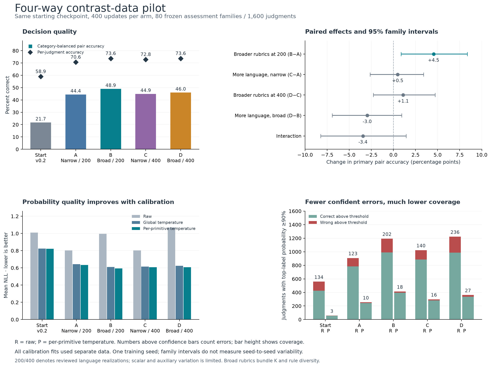
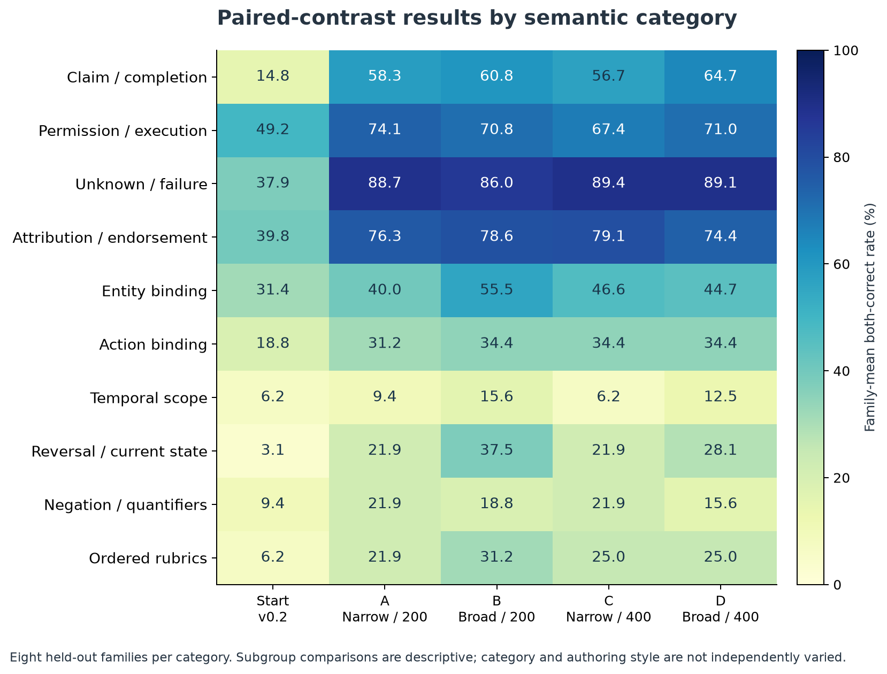

# Four-way contrast-data pilot: completed results

The clearest signal is a benefit from broader rubrics in the 200-pattern comparison. Doubling this particular language bank did not show a clear benefit on the predeclared paired-contrast metric. Continued training improved accuracy substantially, but raw overconfidence remains; separate calibration improves probability quality at much lower high-confidence coverage.

All four arms completed exactly 400 updates. The unchanged starting checkpoint was `judgment-full-v0.2/final`, not an untrained Qwen base model. Each arm used the same 400 latent families, 1,600 cases, 8,000 new judgments, 1,200 matched replay judgments, optimizer recipe and initial weights/random state. Low language used 200 reviewed renderings twice; high language used 400 once. Total examples were held fixed. Narrow Score rubrics used 2–3 levels; broad rubrics used 2–5 levels and more varied decision rules.

The frozen assessment has 80 families, 320 cases and 1,600 judgments. The primary metric counts a contrast as correct only when both endpoints are correct, averages within each family and category, then weights the ten categories equally. It covers 607 meaningful evidence/rubric/question contrasts; 535 invariant relations are reported separately. Ordinary accuracy and complete-case accuracy answer different questions. These are results on the new assessment, not the earlier published Jev subset.

| Model | Judgment accuracy | Primary paired accuracy | All five fields correct | Old-task retention |
|---|---|---|---|---|
| Starting v0.2 | 58.94% | 21.69% | 63/320 | 89.67% |
| A: narrow / 200 | 70.63% | 44.38% | 114/320 | 88.00% |
| B: broad / 200 | 73.63% | 48.92% | 126/320 | 88.00% |
| C: narrow / 400 | 72.81% | 44.86% | 114/320 | 87.67% |
| D: broad / 400 | 73.63% | 45.96% | 120/320 | 87.67% |

B is the point-best primary arm and ties D on ordinary accuracy. It is a candidate for confirmation, not a demonstrated repeatable winner. The starting-checkpoint comparison includes 400 additional updates and replay alongside the new data; the controlled factorial comparisons are between A, B, C and D.

**What the two interventions show.** The predeclared paired family-bootstrap intervals below use 2,000 draws with seed 42. They describe held-out family variation for this one training seed; they do not estimate training-seed variability and are not multiplicity-adjusted.

| Contrast | Primary change (pp) | 95% family interval (pp) |
|---|---|---|
| Broader rubrics at 200 patterns: B−A | +4.55 | [+0.87, +8.35] |
| More language, narrow rubrics: C−A | +0.48 | [-2.65, +3.40] |
| Broader rubrics at 400 patterns: D−C | +1.10 | [-2.28, +4.73] |
| More language, broad rubrics: D−B | -2.97 | [-6.93, +0.93] |
| Interaction: (D−C)−(B−A) | -3.45 | [-8.23, +1.43] |
| Average rubric effect | +2.82 | [+0.05, +5.59] |
| Average language effect | -1.24 | [-3.83, +1.22] |

Broader rubrics helped at low language diversity by 4.55 percentage points. At high language diversity the estimate is only +1.10 points and its interval crosses zero. The average rubric interval barely clears zero. This is a promising, heterogeneous signal rather than a general law. The intervention bundles cardinality coverage and rule diversity, so their individual causes cannot be separated.

Doubling the language bank gives +0.48 points under narrow rubrics and −2.97 under broad rubrics, with both intervals crossing zero. The interaction is also unresolved. C gains 2.19 points of ordinary accuracy over A while barely changing paired accuracy: more individually correct answers did not reliably fix both sides of the contrasts. The result does not establish that broader natural-language or domain data would be useless.

**The accuracy/overconfidence dilemma remains.** Raw B assigns at least 90% probability to 1,193 judgments and is wrong on 202 of them. The starting checkpoint does so on 559 judgments and is wrong on 134. Thus B is more accurate overall and has lower error among its confident answers (16.93% versus 23.97%), but emits far more confident answers and more confident mistakes in total. Its 16.93% conditional error rate is still too high for a calibrated ≥90% group. At ≥95%, B makes 149 errors and D makes 182, versus 51 at the starting checkpoint.

Temperatures were fitted only on 40 separate new calibration families and 150 separate legacy validation records, and all five fits were locked before assessment. Both predeclared calibration variants are reported; neither was chosen using assessment scores. For B:

| B variant | Accuracy | NLL ↓ | Brier ↓ | ≥90% coverage | Wrong / covered | Error among covered |
|---|---|---|---|---|---|---|
| Raw | 73.63% | 0.9960 | 0.4234 | 74.56% | 202/1193 | 16.93% |
| Global temperature | 73.63% | 0.6093 | 0.3562 | 7.31% | 6/117 | 5.13% |
| Per-primitive temperature | 73.63% | 0.5925 | 0.3523 | 25.88% | 18/414 | 4.35% |

Per-primitive calibration reduces B's ≥90% errors from 202 to 18, while coverage falls from 74.56% to 25.88%. It improves probability quality without correcting any wrong argmax decisions. B's fitted temperatures are 2.38 for Noul, 4.69 for Choice and 3.53 for Score; the global temperature is 3.46. These are substantial softening factors. Score means also move: B's mean-Score MAE worsens from 0.499 raw to 0.569 after per-primitive calibration, despite improved NLL/Brier. Calibration is not an improvement on every metric.

| Model | Raw NLL / Brier | Global-T NLL / Brier | Per-primitive-T NLL / Brier |
|---|---|---|---|
| Starting v0.2 | 1.0088 / 0.5744 | 0.8250 / 0.5126 | 0.8218 / 0.5140 |
| A: narrow / 200 | 0.8024 / 0.4309 | 0.6426 / 0.3847 | 0.6341 / 0.3820 |
| B: broad / 200 | 0.9960 / 0.4234 | 0.6093 / 0.3562 | 0.5925 / 0.3523 |
| C: narrow / 400 | 0.8036 / 0.4144 | 0.6158 / 0.3653 | 0.6077 / 0.3629 |
| D: broad / 400 | 1.0676 / 0.4400 | 0.6247 / 0.3676 | 0.6088 / 0.3614 |

**What was learned, and what remains weak.** B recognizes 81 of the 84 gold-Unknown Choice judgments, versus 17 for the starting checkpoint. But it predicts Unknown 159 times: precision is only 50.94%, despite 96.43% recall. All trained arms overpredict Unknown. Temperature scaling cannot change this behavior because it preserves the winning label.

| Model | Unknown correct / gold | Predicted Unknown | Recall | Precision |
|---|---|---|---|---|
| Starting v0.2 | 17/84 | 58 | 20.24% | 29.31% |
| A: narrow / 200 | 78/84 | 184 | 92.86% | 42.39% |
| B: broad / 200 | 81/84 | 159 | 96.43% | 50.94% |
| C: narrow / 400 | 80/84 | 176 | 95.24% | 45.45% |
| D: broad / 400 | 78/84 | 172 | 92.86% | 45.35% |

B's largest primary gains over A occur in entity binding (+15.50 points), reversal/current state (+15.63), and ordered rubrics (+9.38). The profile changes at high language diversity. Temporal scope, negation/quantifiers, and action binding remain weak on this suite. Each category has only eight assessment families; the category and evaluation-author effects are not independently varied.

| Primitive accuracy | Start | A | B | C | D |
|---|---|---|---|---|---|
| Noul | 68.13% | 78.65% | 80.10% | 80.52% | 81.46% |
| Choice | 41.56% | 56.25% | 64.06% | 58.44% | 57.19% |
| Score | 48.75% | 60.94% | 63.75% | 64.06% | 66.56% |

B and D have exactly the same total correct count, but different strengths: D does better on Noul and Score, while B does better on Choice. B's complete-case accuracy is 126/320 (39.38%); reliable whole-request decisions remain substantially harder than individual fields.

**Retention and cost.** The fixed 300-question legacy validation diagnostic falls from 269 correct to 264 for A/B and 263 for C/D: a net loss of five or six correct judgments. This is close, but it is not perfect retention or proof of equivalence.

| Arm | Candidate units | Real tokens | Padded tokens | Training minutes | Peak allocated GiB |
|---|---|---|---|---|---|
| A | 17,376 | 8,412,004 | 8,587,024 | 64.7 | 6.62 |
| B | 18,976 | 9,627,814 | 9,806,732 | 64.1 | 6.73 |
| C | 17,376 | 8,415,556 | 8,590,860 | 43.4 | 6.73 |
| D | 18,976 | 9,631,874 | 9,811,122 | 49.7 | 6.74 |

Training totaled about 3 hours 42 minutes, excluding preparation, smoke and evaluation. Broader rubrics use about 14.2% more padded tokens; language-only comparisons differ by about 0.04%. Equal updates therefore do not mean equal compute. Arms ran sequentially with changing cache/background-GPU conditions; the observed shorter C/D times are not evidence that extra language patterns accelerate training.

**Scope and completion checks.** This is one seed with fixed synthetic semantic programs. Language cards are review-assisted renderings, not 400 independent natural scenarios or reasoning mechanisms; scalar and auxiliary variation is especially limited. Independent semantic review and versioned expert corrections are recorded per card. The old 5,000-family scaling study remains paused, and its unfinished comparison is not a finding of this pilot. No Jev calls or original held-out TEST outcomes were used here.

All four endpoint histories contain exactly 400 updates, identical replay selections by position and identical initial weights/CPU+CUDA RNG. All 375 Adam states per endpoint are at step 400, full checkpoints at 100/200/300/400 are retained, and frozen-body hashes match. Endpoint, calibration, prediction and fit bindings were revalidated; 37 immutable source/data files matched. An independent row-level reconstruction reproduced the metrics and paired intervals. The legacy-suite reader repair occurred before any model evaluation, preserved the endpoint lock/data/weights, and required no retraining; its original failed logs and source snapshots remain archived.

B is the most useful candidate for a second-seed confirmation against A. The current results support testing the rubric effect further and treating probability calibration as a separate concern. No checkpoint has been promoted and no follow-on training has been started.

Full independent metric check · Verification record · Locked machine-readable report

Overview PDF · Overview SVG · Category matrix PDF
