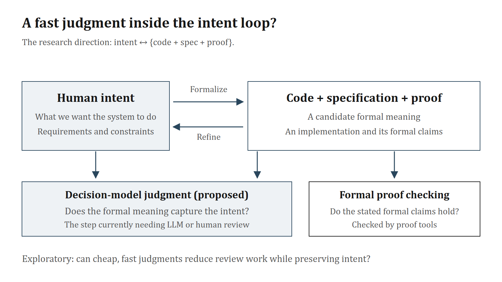

# Content of the tweets

> **For posting:** Publish each numbered section as one extended post, including its number. Attach its diagram beneath each post. Keep external links in the final post. The title, this note and the image descriptions are not part of the post text.

## 1/5

Jev impressed us with how quickly and cheaply it makes decisions. We also watched more than twenty attempts to reproduce parts of it, including a reported two-hour build. That brought us back to the question driving our main work:

intent ↔ {code + spec + proof}

Proof tools can check whether a formal claim holds. They cannot tell us whether that claim says what a person meant. Today, an LLM judge or a person has to review that gap, often repeatedly.

Could a fast decision model take on some of that work? We started with a quick reproduction, then tested Jev on an applied task and finally on proof specifications from our in-house verification-focused benchmark.

## 2/5

First, we tried the fast-decision pattern with Qwen3.5-2B. We trained small adapters and readout heads for about 68 minutes on one RTX 4080, then tested 700 questions from 35 held-out scenario families. The model-written test was frozen before the final training examples were written.

Qwen answered 617/700 correctly (88.1%). Jev 1.13 answered 678/700 (96.9%) on the same test, without being tuned for these categories. The quick reproduction worked on this narrow task, but Jev still led by almost nine points.

On a separate 1,500-case retention set, Qwen's correct answers held steady across the final training stage (1,309 before, 1,319 after). Its probability estimates still need work. An earlier trained checkpoint answered five short questions in about 0.18 seconds locally; we have no like-for-like Jev timing or all-in Qwen serving cost.

## 3/5

We then tried Jev in a different applied setting: an AI-writing detector. It answers eight questions about each text chunk; a fitted rule combines four answers into a score.

On 92 English texts, it flagged 30/48 Claude-written samples and 0/44 human samples at the chosen threshold. But that threshold was selected on the same small set. In an in-sample style breakdown, none of seven Claude texts prompted to sound casual were flagged. The full report includes the texts, saved responses and evaluation code.

That gave us a useful lesson about turning fast judgments into decisions: the question design and the cases you test can change the story. Our next test was closer to the work we actually want to do.

## 4/5

In our in-house verification benchmark KleverBench, we asked whether a candidate proof specification states what the task intended. We built 45 cases from three programs, three language variants and five spec variants: 18 faithful, 27 flawed. Eighteen of the flawed specs still prove, so proof success alone cannot catch them.

Jev's single-question verdict got 36/45 right in 1.1 seconds at about $0.0006 per case. Our Sonnet agent judge got 45/45 in 45.7 seconds at about $0.17; Luna got 43/45 in 69.6 seconds at about $0.0018. Jev accepted none of the 27 flawed specs, but rejected 9 of the 18 faithful ones.

Three narrower Jev questions improved the result to 40/45, with five faithful specs still rejected. That is a striking speed and cost advantage, but not yet the accuracy we need to replace the LLM judge.

![On 45 cases judging whether formal specs capture stated intent, higher correct counts are better; lower counts of flawed specs accepted, faithful specs rejected, time and cost are better. Jev answered 36 correctly in 1.1 seconds at about 0.0006 US dollars per case, accepting no flawed specs but rejecting 9 of 18 faithful ones. The Sonnet agent judge answered all 45 correctly in 45.7 seconds at about 0.17 dollars per case. Three narrower Jev questions improved accuracy to 40 of 45, with five faithful specs still rejected.](04-kleverbench-judge-results.png)

## 5/5

The hard cases tell us where to work next. In one KleverBench variant, familiar operators have unfamiliar meanings defined by the language rules. Jev's remaining errors cluster there. Giving it only the relevant rules did not fix them, while the LLM judges handled nearly all cases even without tools. We think reasoning through those rules, rather than input length alone, is the bottleneck.

We're testing narrower questions and better escalation rules, then we'll try real agent mistakes beyond this small, constructed suite. For now, Jev looks promising as a fast first review; a person or a stronger judge still needs to handle the cases it cannot settle. We're sharing the code, inputs and saved results, including the misses.

Links and projects:

- [All experiments, benchmark cases and saved results](https://github.com/nlp-research-rosu/jev-experiments-public).
- [KleverBench case study](https://github.com/nlp-research-rosu/jev-experiments-public/tree/main/data/kleverbench-judge-v1) and [Jev documentation](https://docs.typesafe.ai/introduction).
- [Qwen3.5-2B](https://huggingface.co/Qwen/Qwen3.5-2B).
- Reproduction trail: [Harsha Gundala's two-hour X post](https://x.com/harshagundal/status/2100044305536889015), [his project](https://huggingface.co/harshatheg/Qwen-2.5-1B-RLCD), [community tracker](https://huggingface.co/spaces/multimodalart/jev-decision-index), [tracker's X post](https://x.com/multimodalart/status/2100691514917880062) and [pinned source for the 20+ count](https://huggingface.co/spaces/multimodalart/jev-decision-index/blob/5709cc7f37476ba7976fa1e71342a142dc4ed7f6/index.html).

